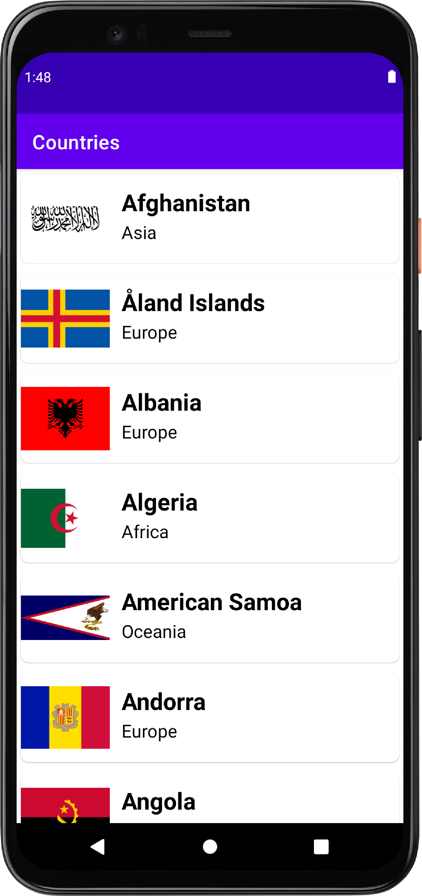
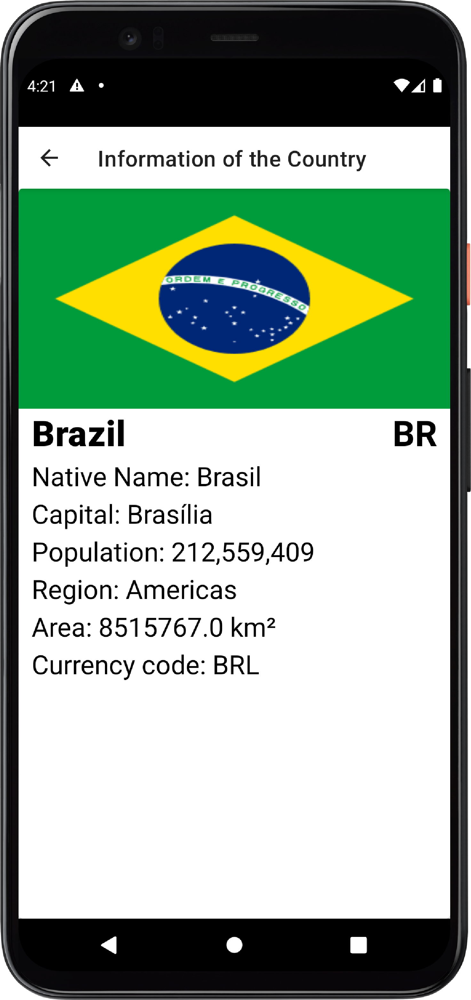

# App Country API (Em construção)
## Aplicação que coleta dados de uma Api de países disponível no link: 
(https://restcountries.com/)

* Lista as bandeiras dos países
* Lista informações de países

Arquitetura utilizada : MVVM
  
  Libs utilizadas:
* Retrofit para fazer as  requisições HTTP  para uma AP pública.
* Injeção de dependências com Koin
* Coroutines para gerenciar a chamada assíncrona dessa  requisição HTTP e definir
  em quias threads devem ser executadas
* Teste Unitários (https://cursokotlin.com/testing-en-android-test-unitarios/)
  
  
