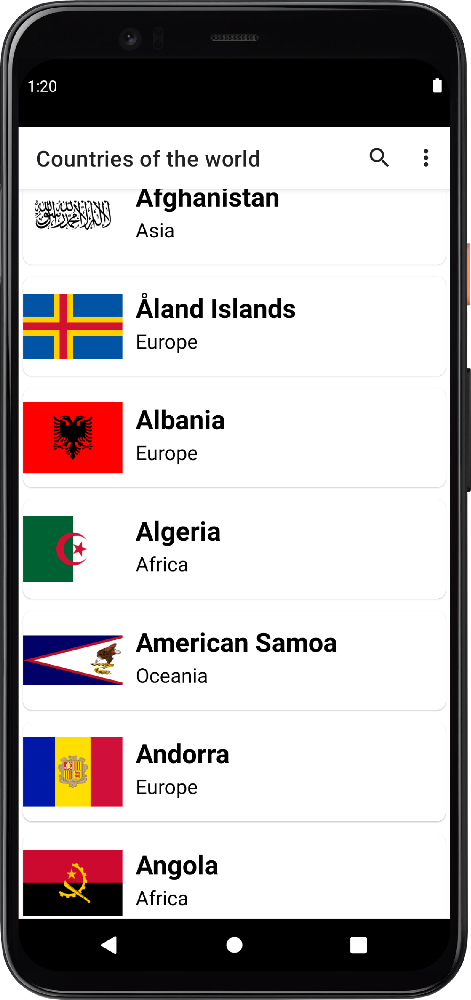
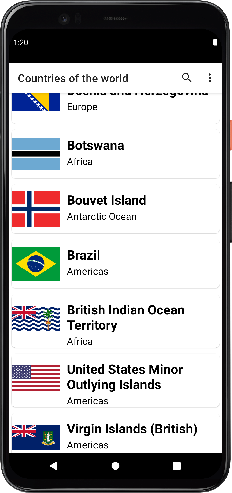
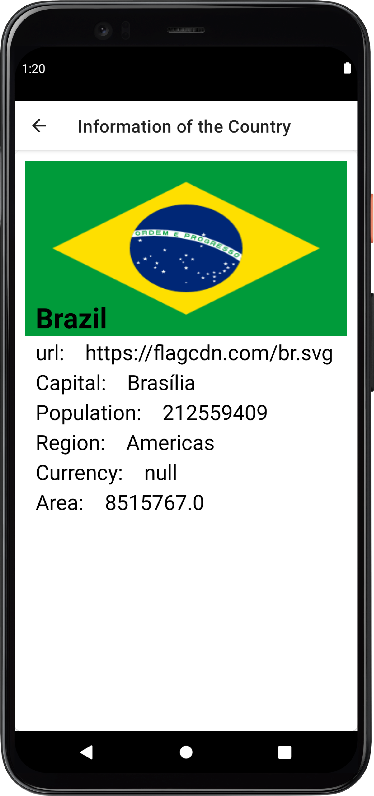

Country API

1.Retrofit para fazer requisições  HTTP  para uma AP pública
2. Coroutines ( Thread leves)  para gerenciar a chamada assíncrona dessa  requisição  HTTPe definir
    em quias threads devem ser executadas
   3. ViewModel para separar  a gerencia de estado e buscar informaçôes  da nossa UI
    4.LiveData par atualizar de forma reativa as inofrmações da tela
      
O layer ViewmModel utilizará  o Architecture Compenet Viewmodel, qwue vai gerenciaro tempo de vida
através da mudança do ciclo de vida da Activity através da injeção usando o provider  que ela traz.

